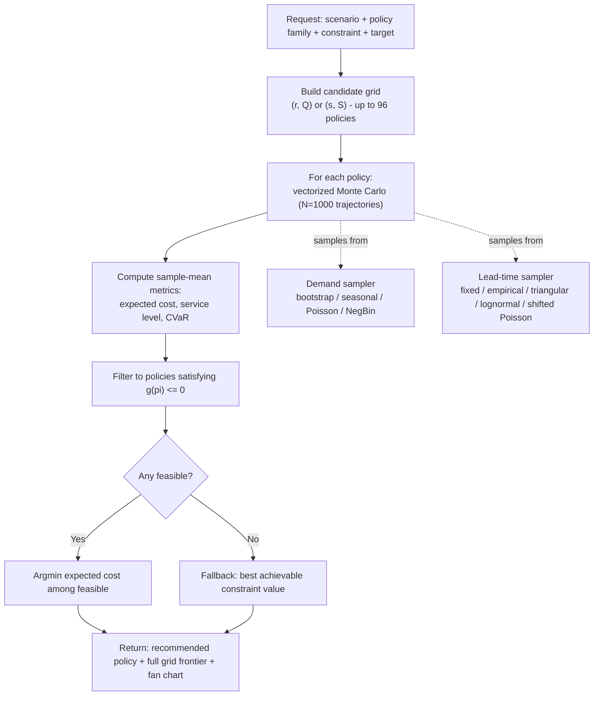
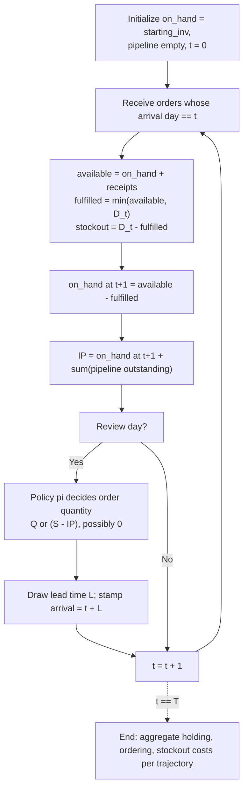

# Model formulation

## Overview

This document describes the optimization model implemented in this
repository. The technique is **simulation-based optimization** - a discrete
grid search over candidate policies scored by **Sample Average
Approximation (SAA)** of the expected cost, with a stochastic constraint on
service level, stockout risk, or CVaR.

No LP, MIP, or convex-programming solver is used. There is no `cvxpy`,
`pyomo`, Gurobi / CBC / CPLEX, Google OR-Tools, `scipy.optimize.linprog`, or
`scipy.optimize.minimize` in the codebase. There is no closed-form
newsvendor calculation, no Wagner–Whitin dynamic program, no stochastic
programming decomposition, and no reinforcement learning.

The algorithm has three steps:

1. Enumerate a grid of up to `n_r * n_q = 96` candidate policies (default),
   hard-capped at `MAX_GRID_POLICIES = 240` in [grid.py](backend/app/domain/grid.py).
2. For each candidate, run a vectorized Monte Carlo simulation of `N = 1000`
   trajectories (default) over a horizon of `T = 180` days (default) and
   compute the sample-mean expected cost, service level, and CVaR.
3. Return the candidate with the minimum sample-mean cost that satisfies
   the chosen constraint. If no candidate is feasible, return the candidate
   with the best achievable constraint value.

---

## 1. Problem statement

### 1.1 Decision variables

Two policy families are supported. In both cases the decision variables are
integers.

**Fixed order quantity (r, Q).** When inventory position drops to or below
$r$, place an order of $Q$ units.

$$
r \in \mathbb{Z}_{\ge 0}, \qquad Q \in \mathbb{Z}_{>0}
$$

**Order-up-to (s, S).** When inventory position drops to or below $s$,
place an order that brings inventory position back up to $S$.

$$
s \in \mathbb{Z}_{\ge 0}, \qquad S \in \mathbb{Z}, \qquad S > s
$$

A policy tuple is denoted $\pi$. Every $\pi$ deterministically maps the
current inventory position to an ordering decision. See
[backend/app/domain/policies.py](backend/app/domain/policies.py).

### 1.2 Random inputs

**Daily demand** $D_t \ge 0$ for $t = 1, \dots, T$, drawn IID from one of
four distributions selected in the request:

- Empirical bootstrap: uniform resample from real historical daily demand.
- Seasonal bootstrap: resample within day-of-week buckets to preserve
  weekly seasonality.
- Poisson: $D_t \sim \text{Poisson}(\lambda)$ with $\lambda$ fit from
  history.
- Negative binomial: moment-matched to history variance.

See [backend/app/domain/demand.py](backend/app/domain/demand.py).

**Lead times** $L_i \ge 1$ (integer days) for each placed order $i$, drawn
from one of five distributions: fixed, empirical, triangular, lognormal, or
shifted Poisson.

See [backend/app/domain/lead_time.py](backend/app/domain/lead_time.py).

### 1.3 State dynamics

For each simulated trajectory $k = 1, \dots, N$, the state advances by:

$$
\begin{aligned}
\text{fulfilled}_t^{(k)} &= \min\bigl(\text{on-hand}_t^{(k)} + \text{receipts}_t^{(k)},\; D_t^{(k)}\bigr) \\
\text{stockout}_t^{(k)} &= D_t^{(k)} - \text{fulfilled}_t^{(k)} \\
\text{on-hand}_{t+1}^{(k)} &= \text{on-hand}_t^{(k)} + \text{receipts}_t^{(k)} - \text{fulfilled}_t^{(k)}
\end{aligned}
$$

The inventory position at the end of day $t$ is
$\text{IP}_t^{(k)} = \text{on-hand}_{t+1}^{(k)} + \text{pipeline}_t^{(k)}$,
where the pipeline is the sum of quantities on outstanding (not yet
received) orders. If the review period is 1 day (the default), the policy
decision is applied every day:

- For (r, Q): if $\text{IP}_t^{(k)} \le r$, place an order of $Q$ units.
- For (s, S): if $\text{IP}_t^{(k)} \le s$, place an order of $S - \text{IP}_t^{(k)}$ units.

Each placed order draws a random lead time $L$ from the lead-time
distribution and arrives at the start of day $t + L$. Unmet demand is
**lost** (not backordered). See
[backend/app/domain/inventory.py](backend/app/domain/inventory.py).

### 1.4 Per-simulation cost

For trajectory $k$ under policy $\pi$:

$$
C^{(k)}(\pi) \;=\; c_h \sum_{t=1}^{T} \text{on-hand}_{t+1}^{(k)}
\;+\; c_K \cdot n_{\text{orders}}^{(k)}
\;+\; c_v \sum_{t=1}^{T} \text{orders}_t^{(k)}
\;+\; c_s \sum_{t=1}^{T} \text{stockout}_t^{(k)}
$$

with:

- $c_h$ = holding cost per unit per day
- $c_K$ = fixed cost per order placed
- $c_v$ = variable cost per unit ordered
- $c_s$ = stockout penalty per unfulfilled unit
- $n_{\text{orders}}^{(k)}$ = number of orders placed in trajectory $k$

The unit purchase price is captured in the cost payload but is not charged
in $C^{(k)}$ - for a fixed horizon under lost sales, total purchase cost
is roughly constant across policies and does not change the argmin. See
the `Costs` docstring in
[backend/app/domain/inventory.py](backend/app/domain/inventory.py).

### 1.5 The optimization problem

$$
\pi^\star \;=\; \argmin_{\pi \, \in \, \mathcal{G}} \; \mathbb{E}\bigl[C(\pi)\bigr]
\quad \text{subject to} \quad g(\pi) \le 0
$$

- $\mathcal{G}$ = the discrete grid of candidate policies (see §2).
- $\mathbb{E}[\cdot]$ = expectation under the demand and lead-time
  distributions defined in §1.2.
- $g(\pi) \le 0$ = one of three constraint modes:
  1. **Service-level:** $1 - \Pr(\text{any stockout day} \mid \pi) \ge \alpha$
     (target service level $\alpha$; default 0.95).
  2. **Stockout-risk:** $\Pr(\text{any stockout day} \mid \pi) \le \beta$
     (max acceptable stockout probability).
  3. **CVaR budget:** $\text{CVaR}_{0.95}\bigl[c_s \cdot \text{stockouts}(\pi)\bigr] \le B$.

See [backend/app/domain/optimize.py](backend/app/domain/optimize.py).

### 1.6 Sample Average Approximation

Neither $\mathbb{E}[C(\pi)]$ nor $g(\pi)$ can be computed in closed form
under empirical demand and general lead-time distributions. Both are
approximated as sample means over $N$ Monte Carlo trajectories:

$$
\widehat{\mathbb{E}}[C(\pi)] \;=\; \frac{1}{N} \sum_{k=1}^{N} C^{(k)}(\pi)
\qquad
\widehat{\Pr}(\text{stockout}\mid\pi) \;=\; \frac{1}{N} \sum_{k=1}^{N} \mathbf{1}\!\left[\exists\, t: \text{stockout}_t^{(k)} > 0\right]
$$

Empirical CVaR is computed as the mean of the worst $\lfloor (1-\alpha) N \rfloor$
per-trajectory losses:

$$
\widehat{\text{CVaR}}_{\alpha}(L) \;=\; \frac{1}{N - \lceil \alpha N \rceil} \sum_{k=\lceil \alpha N \rceil + 1}^{N} L^{(k)}_{\text{sorted asc.}}
$$

with a fallback to $\max_k L^{(k)}$ if the tail after truncation is empty.
See `_cvar` in [backend/app/domain/metrics.py](backend/app/domain/metrics.py).

Substituting sample means for the intractable expectations is called
**Sample Average Approximation (SAA)**. As $N \to \infty$ the SAA solution
converges to the true optimum, with the standard error of each sample mean
shrinking as $1/\sqrt{N}$ — so buying an extra decimal place of precision
costs a hundredfold in compute.

The app defaults to $N = 1000$, which is a deliberate trade against that
curve rather than a claim about where the estimate stops moving. Every run is
exactly reproducible under the default seed of 42, but reproducibility is not
the same as convergence, and the two parameters of the recommendation settle
at different rates:

- The **reorder point $r$** is stable. It is pinned by a tail quantile of
  demand-during-lead-time, and across all three bundled scenarios in both
  policy families — six combinations, seed 42, 95% target — it is *identical*
  at $N = 1000$ and $N = 2000$.
- The **order quantity $Q$ / order-up-to $S$** is noisier. Over those same six
  combinations it was unchanged in three and moved by 7.6%, 9.0% and 17.7% in
  the others. The expected-cost surface is genuinely flat in that direction —
  ordering somewhat more or less per cycle trades holding cost against
  ordering cost almost evenly — so the sample mean has little gradient to
  latch onto, and the argmin wanders within a shallow basin.

That split is convenient, because $r$ is what determines whether the
reliability constraint is met. The constraint answer is firm at $N = 1000$;
the cycle-size recommendation should be read as approximate.

Raise $N$ (up to `MAX_N_SIMULATIONS`) when the cost-vs-reliability frontier
looks too ragged to read, and expect the wait to grow linearly.

### 1.7 The algorithm, in pseudocode

```python
best = None
for pi in candidate_grid:              # up to 96 policies (default)
    metrics = simulate(pi, N=1000)     # vectorized NumPy Monte Carlo
    if metrics.satisfies(constraint):
        if best is None or metrics.expected_cost < best.expected_cost:
            best = (pi, metrics)
if best is None:
    best = argmax_over_grid(constraint_slack)  # fallback: closest to feasibility
return best
```

See `evaluate_policies` and `select_policy` in
[backend/app/domain/optimize.py](backend/app/domain/optimize.py).

---

## 2. Candidate grid construction

The grid is sized from lead-time-demand quantiles estimated by a
preliminary Monte Carlo pass of 2000 draws.

Let $\bar{d}$ be the expected daily demand (clipped to $\ge 0.5$) and let
$q_{0.995}$ be the 99.5th percentile of demand-during-lead-time. The grid
axes are:

- **Reorder point** $r$: `n_r = 12` values evenly spaced (integers, deduped)
  in $[0, \max(q_{0.995},\; \bar{d} \cdot \mathbb{E}[L] + \bar{d})]$.
- **Order quantity** $Q$ (for r, Q): `n_q = 8` values in
  $[\max(3\bar{d}, 1),\; \max(35\bar{d}, \ldots)]$ - three days to
  thirty-five days of average demand.
- **Top-up delta** $S - r$ (for s, S): `n_s_over_r = 8` values on the same
  range.

The full grid has up to $12 \times 8 = 96$ candidates before deduplication.
`MAX_GRID_POLICIES = 240` is a hard cap that is not reached at the default
axis sizes. See [backend/app/domain/grid.py](backend/app/domain/grid.py).

---

## 3. Comparison to solver-based approaches

A solver-based formulation of the same problem is technically possible.
The most common such formulation is a **two-stage stochastic program**
solved by an MIP solver (Gurobi, CBC, CPLEX) or a decomposition method
(L-shaped / Benders / progressive hedging). Such a formulation would
introduce decision variables for every (scenario, day, action) triple,
linear constraints wiring the inventory flow across time, big-$M$
constraints encoding the threshold-triggered ordering rule, and a
scenario-weighted objective.

That approach is not used in this repository. Three reasons:

1. **The policy space is two integers.** A 96-candidate grid covers the
   region of interest with tight enough spacing that the true continuous
   optimum is at most a few units away from the returned grid point.
2. **The dynamics are non-convex.** Threshold-triggered ordering is a
   discrete event; encoding it in an MIP with big-$M$ works but inflates
   model size and solve time compared to direct simulation.
3. **The demand distribution is empirical.** Even a solver-based
   formulation would need to reduce the demand distribution to a finite
   set of scenarios, at which point it's doing SAA. The vectorized
   NumPy simulator in this repo evaluates the entire grid in about one to
   two seconds; a solver-based path would be significantly slower for
   comparable statistical precision.

Consequences of the chosen approach:

- **No proof of optimality** relative to the continuous policy space. The
  returned policy is optimal only among the grid candidates.
- **Sampling noise** in the sample-mean estimates of both the objective
  and the constraint. Precision scales as $O(1/\sqrt{N})$.
- **No common random numbers.** In
  [backend/app/domain/optimize.py](backend/app/domain/optimize.py),
  `_seeded_rng(base_rng, i)` gives each policy a distinct RNG seed. Using
  common random numbers across policies would reduce variance in
  pairwise comparisons and produce a smoother frontier.

---

## 4. End-to-end pipeline



Code map:

- Grid construction: [backend/app/domain/grid.py](backend/app/domain/grid.py)
- Policy definitions: [backend/app/domain/policies.py](backend/app/domain/policies.py)
- Monte Carlo simulator: [backend/app/domain/inventory.py](backend/app/domain/inventory.py)
- Demand samplers: [backend/app/domain/demand.py](backend/app/domain/demand.py)
- Lead-time samplers: [backend/app/domain/lead_time.py](backend/app/domain/lead_time.py)
- Sample-mean metrics + CVaR: [backend/app/domain/metrics.py](backend/app/domain/metrics.py)
- Feasibility filter + argmin: [backend/app/domain/optimize.py](backend/app/domain/optimize.py)
- API orchestration + response shaping: [backend/app/api/services.py](backend/app/api/services.py)

---

## 5. Inner Monte Carlo loop

For a single policy $\pi$, all $N$ trajectories advance in lockstep as
NumPy arrays of shape `(N, T)`. The Python-level loop runs once per day,
not once per (day, trajectory).



The per-trajectory total cost $C^{(k)}$ is averaged across the $N$
trajectories to produce the sample-mean expected cost for that policy.

---

## 6. Technique classification

| Technique | Used here? | Note |
|---|---|---|
| Closed-form newsvendor | No | Requires Normal demand and fixed lead time. |
| Base-stock analytical formula | No | Requires stationary demand and closed-form distribution. |
| Wagner–Whitin dynamic program | No | Solves deterministic-demand lot sizing; different problem. |
| MDP / policy iteration | No | Overkill for a 2-parameter policy family. |
| Reinforcement learning | No | Same. |
| Two-stage stochastic programming (SAA + solver) | No | See §3. |
| **Simulation-based optimization** | **Yes** | Grid search over policies, SAA of cost and constraint. |
| Common Random Numbers (variance reduction) | No | Each policy uses a distinct seed; see §3. |
| Ranking-and-selection (Rinott, KN) | No | Not used at the current grid size. |

---

## 7. Assumptions and limitations

1. **Lost sales, not backorders.** Unmet demand is not carried into
   subsequent periods; the stockout penalty is applied per lost unit.
2. **IID demand within a trajectory.** The empirical bootstrap draws
   independently across days. Seasonal bootstrap preserves day-of-week
   variation only; longer-range trend or autocorrelation is not modeled.
3. **Independent lead times.** Lead times are drawn independently per
   placed order; there is no correlation between consecutive shipments.
4. **Cycle service level is defined as $1 - \Pr(\text{any stockout day})$**,
   which is stricter than the classical Type-1 service level and different
   from the fill rate. Both are reported.
5. **Grid discretization.** The reported optimum is optimal among the
   grid candidates only. The true continuous optimum may be a few units
   away.
6. **Unit purchase cost is captured but not charged** in the objective
   (see §1.4).
7. **No common random numbers.** Distinct seeds per policy add Monte
   Carlo noise to pairwise comparisons; the frontier is not as smooth as
   it would be with CRN.
8. **Infeasible-constraint fallback is silent at the model layer.** If
   no grid policy satisfies the constraint, `select_policy` returns the
   policy with the best achievable constraint value; the API response
   does not currently flag this as a fallback.

---

## 8. Glossary

- **Policy** - a deterministic rule mapping inventory state to an
  ordering decision.
- **Trajectory / simulation** - one random $T$-day realization of demand
  and lead times under a specific policy.
- **Monte Carlo estimate** - a sample mean over independent trajectories,
  used to approximate an expectation.
- **Sample Average Approximation (SAA)** - replacing $\mathbb{E}[f(X)]$
  with $\tfrac{1}{N}\sum_k f(X^{(k)})$ in an optimization problem.
- **Frontier** - the scatter of (expected cost, service level) pairs
  across candidate policies. Its lower-right envelope is the Pareto set.
- **CVaR (Conditional Value at Risk)** - the expected loss conditional on
  being in the worst $1-\alpha$ tail. A coherent tail-risk metric.
- **Cycle service level** - $1 - \Pr(\text{any stockout day})$.
- **Fill rate** - $\mathbb{E}[\text{fulfilled units} / \text{demanded units}]$.

---

## 9. References

- Zipkin, P. H. *Foundations of Inventory Management.* McGraw-Hill, 2000.
- Shapiro, A., Dentcheva, D., Ruszczyński, A. *Lectures on Stochastic
  Programming: Modeling and Theory.* 2nd ed., SIAM, 2014 - Chapter 5
  covers SAA convergence.
- Silver, E. A., Pyke, D. F., Peterson, R. *Inventory Management and
  Production Planning and Scheduling.* 3rd ed., Wiley, 1998.
- Rockafellar, R. T., Uryasev, S. "Optimization of Conditional
  Value-at-Risk." *Journal of Risk*, 2000.
